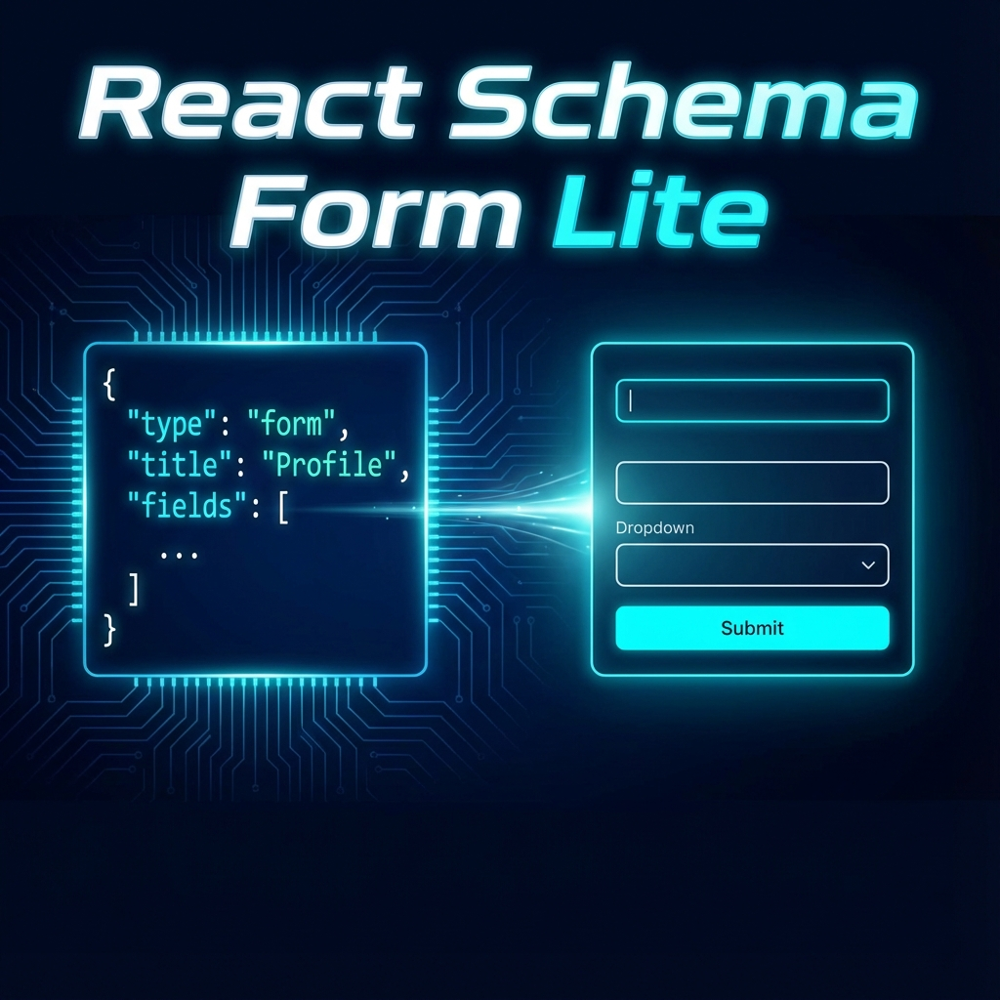

# React Schema Form Lite (轻量级动态表单引擎)

**零代码、元数据驱动的 React 表单引擎 —— 专为学习与轻量级场景打造。**

> 🎯 **核心目标**：通过本项目，带你深入理解 **元数据驱动 (Metadata Driven)**、**组件注册模式 (Registry Pattern)** 以及 **递归渲染** 等高级前端开发概念。

## ✨ 核心特性

- **JSON 即表单**：后端下发 JSON 配置，前端自动渲染出完整的复杂表单。
- **🚀 高性能渲染**：基于 `react-hook-form` 管理状态，杜绝输入卡顿，性能优越。
- **🧩 组件注册表模式**：解耦核心引擎与 UI 组件，支持无限扩展（可替换为 Material UI, Vue 等）。
- **🔗 动态联动**：内置 `useDependency` 钩子，轻松实现 "选择 A 显示 B" 的复杂联动逻辑。
- **🌲 递归分组**：支持 `Group` (分组) 无限嵌套，构建复杂的表单结构。
- **🛡️ 完备的 TypeScript 类型**：提供极佳的开发体验和代码提示。

## 📸 功能演示 (Demo)

*(在此处插入 GIF 动图: 演示输入联动、校验报错、实时 JSON 编辑更新表单)*

### 1. 实时预览
左侧编辑 JSON，右侧表单即时更新。

### 2. 动态联动 (Dependency)
当“是否拥有宠物”开关打开时，“宠物类型”下拉框自动出现。

### 3. 表单校验
内置必填、正则等多种校验规则，实时反馈错误信息。

## 🛠️ 快速开始

### 1. 安装项目

```bash
git clone https://github.com/your-username/react-schema-form-lite.git
cd react-schema-form-lite
npm install
```

### 2. 启动开发服务器

```bash
npm run dev
```
打开浏览器访问 `http://localhost:5173` 即可看到演示页面。

## 📦 项目结构

本项目采用了清晰的类 Monorepo 结构，方便学习与维护：

```text
src/
├── core/                  # ⚡️ 核心引擎层 (最重要!)
│   ├── SchemaForm.tsx     # 表单入口组件
│   ├── SchemaItem.tsx     # 递归渲染器 (字段包装器)
│   ├── registry.ts        # 组件注册中心 (单例模式)
│   ├── types.ts           # 核心 TS 类型定义
│   └── hooks/             # 核心 Hooks (如 useDependency)
├── components/            # 🎨 内置 UI 组件库
│   ├── widgets.tsx        # Input, Select 等具体实现
│   └── index.ts
├── demo/                  # 🎪 演示应用
│   └── App.tsx            # JSON 编辑器 + 预览界面
└── index.css              # TailwindCSS 样式
```

## 📖 核心 API

### FieldSchema (字段定义)

这是描述表单长什么样的核心数据结构：

```typescript
interface FieldSchema {
  name: string;        // 字段唯一 key
  type: string;        // 组件类型 ('input', 'select', 'group'...)
  label?: string;      // 标题
  rules?: FieldRules;  // 校验规则
  dependencies?: {     // 联动依赖
    field: string;
    value: any;
  }[];
  props?: any;         // 透传给 UI 组件的属性
  children?: FieldSchema[]; // 子节点 (用于 group)
}
```

### 自定义组件注册

想要支持新的组件（比如富文本编辑器）？只需两步：

1. **编写组件**：
```tsx
const MyColorPicker: React.FC<WidgetProps> = ({ value, onChange }) => {
  return <input type="color" value={value} onChange={e => onChange(e.target.value)} />;
};
```

2. **注册组件**：
```ts
import registry from './core/registry';
registry.register('color-picker', MyColorPicker);
```

3. **在 JSON 中使用**：
```json
{ "type": "color-picker", "name": "themeColor", "label": "主题色" }
```

## 🤝 贡献指南

欢迎提交 PR！本项目非常适合新手练习以下技能：
- 编写复杂的 TypeScript 泛型
- 学习 React Context 和 Hooks 性能优化
- 设计可扩展的前端架构

## 📄 开源协议

MIT License
